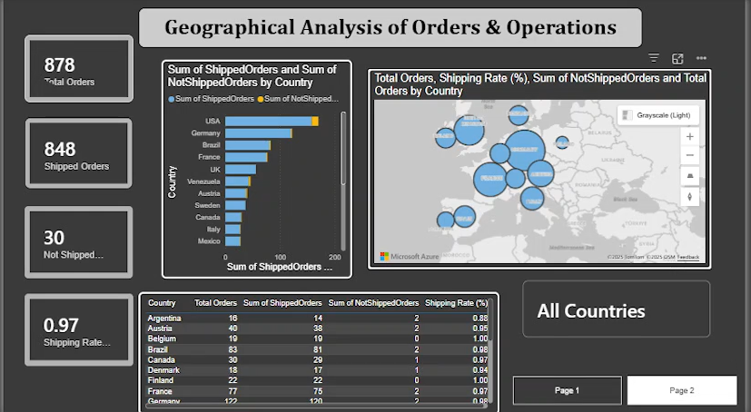
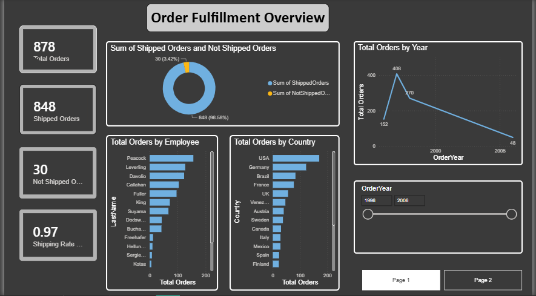

# 📊 Northwind Data Warehouse & Business Intelligence Project




## 📌 Description du projet

Ce projet académique consiste à concevoir et implémenter une solution complète de **Business Intelligence** basée sur la base de données **Northwind**.

L’objectif principal est de :
- intégrer des données provenant de **SQL Server** et **Microsoft Access**,
- construire un **Data Warehouse** en schéma en étoile,
- analyser les commandes **expédiées et non expédiées**,
- créer des dashboards interactifs sous **Power BI**,
- et réaliser des analyses complémentaires à l’aide de **Python**.

---

## 🎯 Objectifs analytiques

La question analytique principale est :

> **Combien de commandes sont expédiées et non expédiées selon le temps, le client et l’employé ?**

---

## 🗄️ Sources de données

- **SQL Server (Northwind)**  
  Tables principales : Orders, Customers, Employees

- **Microsoft Access (Northwind)**  
  Tables équivalentes avec un volume de données plus réduit

---

## 🏗️ Architecture du Data Warehouse

Le Data Warehouse est conçu selon un **schéma en étoile** :

### Table de faits
- **FactOrders**
  - ShippedOrders
  - NotShippedOrders

### Dimensions
- **DimTime** (année, mois)
- **DimCustomer** (client, localisation)
- **DimEmployee** (employé, localisation)

---

## 🔄 Processus ETL (Power BI)

Power BI a été utilisé comme outil ETL via **Power Query Editor** :

- Extraction des données depuis SQL Server et Access
- Nettoyage et transformation des données
- Création des dimensions :
  - suppression des doublons
  - création de clés techniques
  - création de colonnes dérivées (année, mois, contact name)
- Création de la table de faits :
  - colonnes personnalisées pour les commandes expédiées / non expédiées
- Création des relations (schéma en étoile)
- Append des données provenant des deux sources

---

## 📊 Visualisation avec Power BI

### 📄 Page 1 – Order Fulfillment Overview
- KPI : Total Orders, Shipped Orders, Not Shipped Orders, Shipping Rate
- Donut chart (Shipped vs Not Shipped)
- Bar charts (par pays, par employé)
- Line chart (évolution par année)
- Slicer temporel

### 📄 Page 2 – Geographical Analysis of Orders & Operations
- Carte géographique des pays
- Mesure dynamique du pays sélectionné
- Tableau récapitulatif
- Bar chart empilé
- KPI dynamiques

---

## 🐍 Analyse et chargement avec Python

Python est utilisé pour :
- charger les données depuis un fichier Excel vers SQL Server,
- analyser les données du Data Warehouse,
- joindre les tables du schéma en étoile dans un seul DataFrame,
- produire des visualisations analytiques complémentaires.

### Bibliothèques utilisées :
- pandas
- matplotlib
- sqlalchemy
- pyodbc

---

## ▶️ Exécution des scripts Python

1. Installer les dépendances :
```bash
pip install -r requirements.txt
# Northing-BI-Project
